# Installation & Configuration
### Chrome
统一调试浏览器为Google Chrome浏览器。直接从课程平台资料中下载运行安装即可

### Git
系统中已安装git即可，无需安装最新版，安装最新版自动覆盖旧版。  
课程全部代码将推送到github，学生需了解并掌握基本git/github的使用方法。  
Idea默认包含git可视化操作插件，但并没有集成git本身(eclipse集成git)，因此需单独安装git。

**Git必须安装到英文路径，建议仅更改盘符**

运行安装程序后，除安装地址外，其他选项全部默认  
  
可以取消安装，windows explorer integration下的，git bash here，git GUI here  
不要修改其他所有过程选项，全部默认即可  
可查看版本  
  
### Uninstall Oracle JDK
统一JDK环境为OpenJDK，卸载安装过的Oracle JDK  
删除系统环境变量中设置的JAVA_HOME环境变量，以及path路径

### Register IntelliJ IDEA
### Install IntelliJ IDEA
###  Maven
# Optimizing IntelliJ IDEA
### Code Completion
### Font Size & Style
<span style="color: red">**Idea/maven的安装配置，参照java程序设计课程方法**</span>

# Web Project
### Create Web Project
在合适位置创建工作区目录，存放课程项目文件。  
例如，D:\workspace-2020    
创建第一个maven web项目  
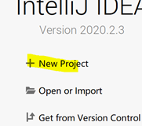  

首次基于idea创建maven项目时，可能需要指定OpenJDK目录  
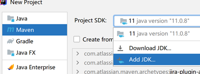  

定位到idea目录下的jbr，即可识别最新版idea集成的OpenJDK  
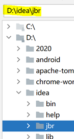  
Maven项目属性说明  
Group：开发组织域名反写，确保开发组织的全球唯一性  
Artifact：本次开发项目名称，确保开发组织下项目的唯一性，从而确保项目的全球唯一性  
工程名称与artifact保持一致，定位工程位置为工作区  
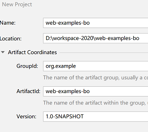  

选择自动导入maven项目  
Windows10系统，可能会出现涉及defender配置  
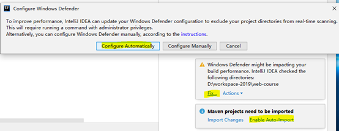  

Maven工程结构。其中pom.xml为自动生成的maven项目配置文件  
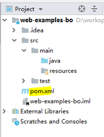  

修改pom.xml文件，追加maven项目打包配置声明。即，声明普通maven项目为maven web项目  
结果。后期涉及java知识时，还需添加配置  
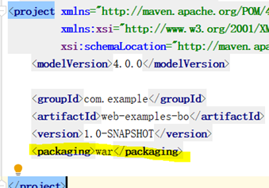  

在src/main下，创建名为webapp的目录。Webapp目录为maven项目默认的网页资源目录，所有HTML等网页资源，必须置于此目录下  
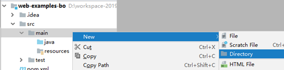  
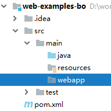  

在webapp下，创建基于html5名为index的html文件  
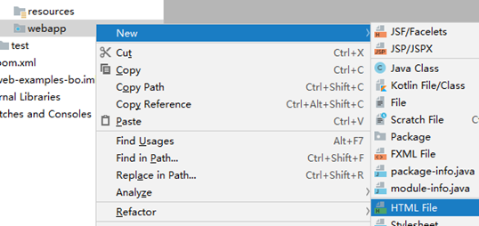  
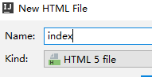  

在index.html输入代码  

```html
<!DOCTYPE html>
<html lang="en">
<head>
    <meta charset="UTF-8">
    <title>Title</title>
</head>
<body>
<h1>hello world</h1>
</body>
</html>
```
当鼠标悬停在html文档，可显示直接运行的浏览器  
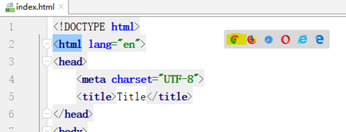  
运行查看结果  
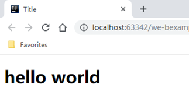

## Delete Project
关闭当前项目，返回welcome页面  
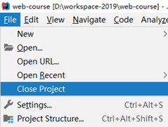  

移除项目，此时仅在idea中移除了项目，并没有在磁盘删除项目文件  
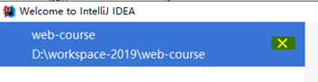  
**在工作区目录，手动删除项目目录**

# Cloning Repository
### Clone
为便于学习，课程通过创建一个项目(project)，在项目中创建若干模块(module)实现。因此，仅需从github clone一次项目，每次拉取更新即可。  
可以在此项目中创建自己的学习测试module，不会影响到课程代码

**确定系统已安装git**

关闭当前项目，返回首页。选择通过git获取远程项目  
  

复制链接  
https://github.com/bwhyman/web-course  
在默认工作区创建同名目录  
  

打开左侧project视图，clone下的项目与开发时的项目完全相同，当前包含课程模块web-examples，后续将添加实验模块  


### Update
课程代码更新后会推送到github，，需更新项目拉取最新的代码  


### Create New Module
可以在此项目中创建自己的学习测试module  
  

基本maven module  
  

名称不能冲突，可以以用户名命名  
  

目录名称与artifactid名称相同  
  

追加打包类型war  
  
其他，在自定义module中，创建webapp，创建html文档等操作

### Delete Module
在项目中删除不需要的module  
为防止误操作，idea禁止直接删除项目中的模块。需要先将模块从项目移除，此时模块所有文件均没有从磁盘删除，还可重新导入  
  

模块从项目中卸下后变为灰色，并出现删除选项，此时可完全从磁盘删除  
  

打开项目pom.xml配置，其中模块声明没有被自动删除  
  

手动删除声明  
