# Installation & Configuration
### Chrome
开发调试浏览器，统一使用Google Chrome浏览器。

### IntelliJ IDEA

[Idea/maven安装配置，参照Java程序设计课程方法](https://github.com/bwhyman/java-course/blob/master/Home.md)

### Create Web Project
[Idea下创建Maven Web项目](https://mooc1.chaoxing.com/nodedetailcontroller/visitnodedetail?courseId=91374545&knowledgeId=368925223)

### Delete Project
参考Java课程示例  

### Git
系统中已安装git即可，无需安装最新版，安装最新版自动覆盖旧版。  
课程全部代码将推送到github，学生需了解并掌握基本git/github的使用方法。  
Idea默认包含git可视化操作插件，但并没有集成git本身(eclipse集成git)，因此需单独安装git。

**Git必须安装到英文路径，建议仅更改盘符**

运行安装程序后，除安装地址外，其他选项全部默认  
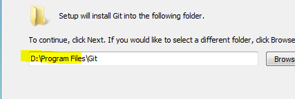  
可以取消安装，windows explorer integration下的，git bash here，git GUI here  
不要修改其他所有过程选项，全部默认即可  
可查看版本  
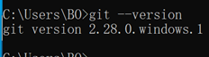

### Cloning Repository
参考Java课程示例  

为便于学习，课程通过创建一个项目(project)，在项目中创建若干模块(module)实现。因此，仅需从github clone一次项目，每次拉取更新即可。  
可以在此项目中创建自己的学习测试module，不会影响到课程代码

**确定系统已安装git**

关闭当前项目，返回首页。选择通过git获取远程项目  
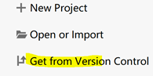  

复制链接  
https://github.com/bwhyman/web-course  
在默认工作区创建同名目录  
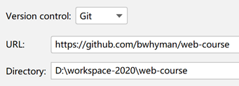  

打开左侧project视图，clone下的项目与开发时的项目完全相同，当前包含课程模块web-examples，后续将添加实验模块  
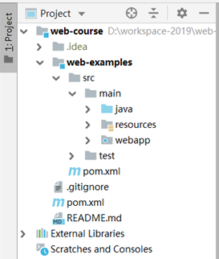

### Update
课程代码更新后会推送到github，，需更新项目拉取最新的代码  
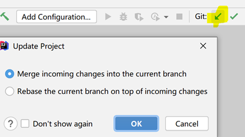

### Create New Module
可以在此项目中创建自己的学习测试module  
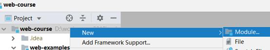  

基本maven module  
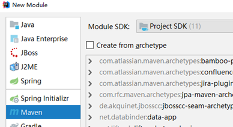  

名称不能冲突，可以以用户名命名  
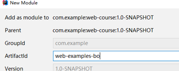  

目录名称与artifactid名称相同  
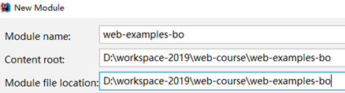  

追加打包类型war  
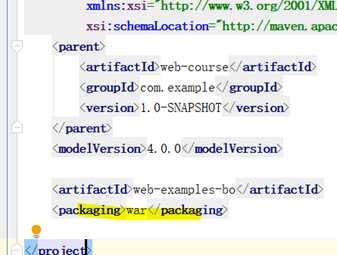  
其他，在自定义module中，创建webapp，创建html文档等操作

### Delete Module
在项目中删除不需要的module  
为防止误操作，idea禁止直接删除项目中的模块。需要先将模块从项目移除，此时模块所有文件均没有从磁盘删除，还可重新导入  
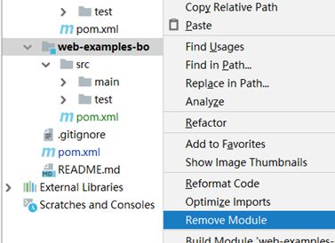  

模块从项目中卸下后变为灰色，并出现删除选项，此时可完全从磁盘删除  
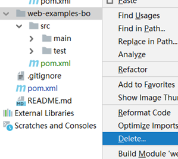  

打开项目pom.xml配置，其中模块声明没有被自动删除  
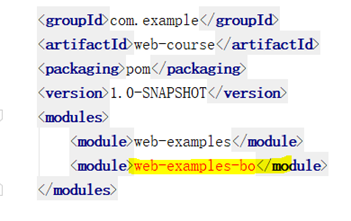  

手动删除声明  
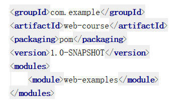