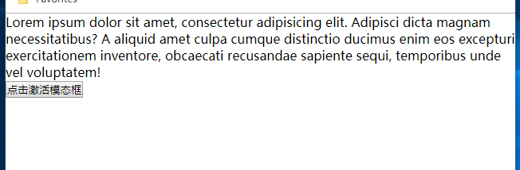

# Homework-05
### 模态框
Modal模态框是一种更灵活、更强大的自定义对话框  
实现效果：当模态框被激活，覆盖在网页内容上，并在弹出的窗口中显式详细互交信息  
模拟bootstrap的实现：https://v3.bootcss.com/javascript/#modals  
可以通过国内CDN节点引入jquery，https://cdn.bootcss.com/jquery/3.4.1/jquery.min.js  

### 原理与思路
布局与样式  
模态框容器，默认隐藏，显式时绝对定位覆盖在显式窗口  
模态框容器背景色而非元素透明，否则容器内的元素也会透明，rgba()  
模态框容器内对话框，显式声明宽度，居中，相对定位，从而可以添加渐入渐出效果  
对话框，可包含header container footer部分，可添加下边线分割显式内容  

jquery  
当激活模态框时，模态框渐入  
希望实现，当点击模态框内，对话框外，即空白区域时，关闭模态框。但空白区域不是独立的元素，而是模态框元素的一部分。即，无法通过选择器选取该区域  
因此，可将关闭的点击事件监听注册在模态框容器。但是，当点击模态框内的对话框，一样会关闭模态框，从而无法实现与对话框的互交  
事件的向上冒泡机制。当子元素事件被激活，一样会影响到父元素监听的事件。
即，当激活子元素点击事件，如果父元素也注册了点击事件，则也会激活父元素的点击事件。即，事件的冒泡传播  
因此，可通过在子元素中阻止事件的冒泡，实现在对话框内操作时，不会影响到模态框容器  
实现，对对话框监听点击，回调中返回false，即可阻止父元素模态框对点击事件的回调  

可通过animate()方法，添加对话框的动态定位，从默认的顶端，渐变定位到距上30px，即对话框从上向下渐入；关闭模态框时，再将对话框渐变定位到顶端，即，从下向上渐出  

