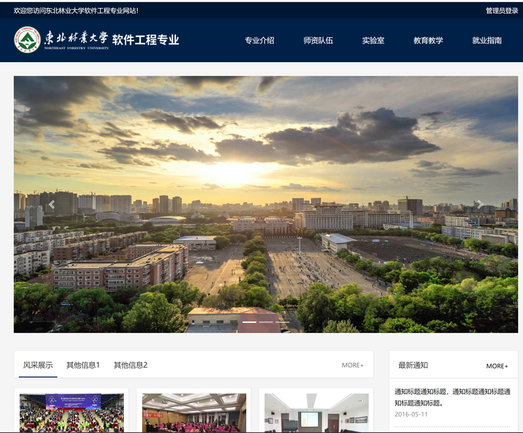

# Web开发技术项目设计

### 项目要求
基于HTML/CSS/JS/Servlet/JDBC等技术完成以下设计内容  
允许并鼓励使用Bootstrap/easy-ui/flat-ui等UI框架，及轮播/动画/图表/全屏滚动等等插件  
允许使用vue/react/springboot等技术，但需部署在学生个人服务器，提供访问网址  
本设计占总成绩40%，按功能完成设计状况评分，且按标准打包并部署在平台是成绩的一部分  
分组：每人1组，独立完成  
截至时间：具体日期待定  
提交/部署方式：以war包上传到指定系统，统一部署在华为云服务器；也允许部署在个人服务器    
部署环境：Docker Tomcat+MySQL容器  
项目展示：所有学生项目在公网公开展示  

### 设计内容
软件工程专业网站  
主要考核内容：网站整体设计，用户互交体验  
包括：HTML布局，HTML标签的使用，应用CSS样式增强网站显示效果，使用JS动态改变页面，Servlet对数据的处理，JDBC数据库访问等  

### 主要功能
#### 前台网站
主要板块内容：专业介绍，实验室，教师队伍，就业指南，新闻，公告等。  
要求至少包含导航。  
要求板块必须包含2级内容。例如，专业介绍：专业简介，方向简介等；实验室：923创新实验室，925移动开发实验室，923实验室等；并能跳转至2级详细内容。  

教师队伍：教授，副教授，讲师等  
例如，当点击副教授时，跳转至副教授列表，再次点击某教师时，跳转至教师详细介绍，内容应尽可能包含文字/图片多媒体等信息  

新闻公告：主页列出最近5个新闻与公告，显示标题时间等，要求从数据库中获取，点击标题跳转至信息的详细描述。  

#### 后台系统
需在前台网站显示提供后台关系系统入口链接，后台统一管理员登录用户名/密码admin  
管理员登录后，可在后台对新闻公告信息进行增加，增删改查全部完成有加分  
过滤器，未登录状态无法访问进入后台管理系统  
仅需实现发布基本文本信息，无需包含图片等附件，实现富文本提交有加分  

信息无需分页  
除新闻公告外，教师实验室介绍等可使用静态数据  
所有介绍类内容应尽可能包含文字与图片  
所有文字/图片不必使用真实信息  

### 往年部分作品展示截图

