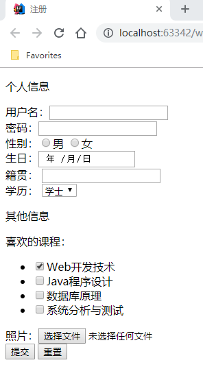

# 实验一 HTML基本标签实验
### 实验原理
通过创建HTML5网页，验证form内多种元素标签及其属性的作用及意义。  
### 实验目的
理解并掌握Form表单提交必须声明的内容  
理解并掌握Input元素中多种类型属性的使用方法及使用场景  
理解并掌握Label元素的使用方法  
理解并掌握Datalist元素的使用方法  
理解并掌握Required、checked等input基本属性的使用方法  
理解并掌握button元素 submit reset类型的使用方法  
### 实验内容
基于web-experiments，以及：  
 - 声明项目打包类型为war
 - 在src/main下，创建webapp目录
 - 在webapp目录下，创建register.html文件，完成一个注册页面的设计
### 需求+设计提示
注册表单。模拟向地址：/register，发起post请求  
个人信息。在form表单中用div分块  
用户名与密码。必填，密码禁止显式显示  
性别。单选组，通过label标签控制文本可点击  
生日。日期类型  
籍贯。允许用户通过下拉选择或手动输入  
学历，可以不选择，包括，学士(默认)，硕士，博士。下拉单项选择，空选项，下拉的默认选中状态属性  

其他信息组。用div分块  
喜欢的课程，包括，Web开发技术(默认选中)，Java语言程序设计，数据库原理，系统分析与测试。
多选组通过list列表实现，label标签控制文本可点击，默认选中属性  
照片。选择文件，且友好限制用户上传文件类型为常用图片格式  
提交、重置，按钮。需声明正确的类型  

通过idea运行浏览器，查看结果  

