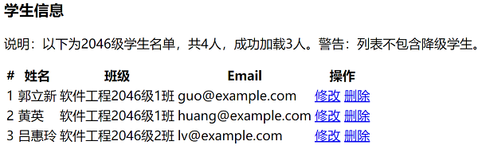
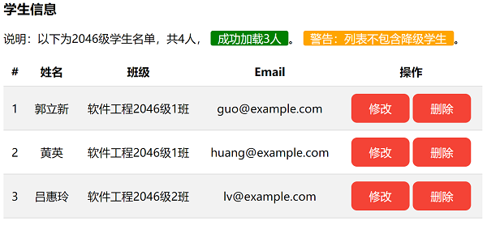

# 实验二 CSS基本样式实验
### 实验原理
通过创建CSS样式文件，理解CSS样式基本属性作用及意义。
### 实验目的
理解CSS基本概念及功能  
理解CSS样式的设计原则  
理解并掌握CSS样式的基本声明方法  
理解并掌握多种CSS选择器的使用方法  
理解并掌握字文本、表格、超链接等元素常用属性的使用方法  
理解并掌握背景、颜色、内外边距、尺寸、圆角等CSS基本属性的使用方法  

### 实验内容
基于web-experiments项目    
在src/main下，创建webapp目录  
在webapp目录下，创建table.html文件，编写测试数据，完成一个数据表格

运行显示结果  

### 需求+设计提示 
实现，通过定义CSS属性，优化以上html内容  

文本容器样式  
创建一个抽象的标签文本容器样式，默认标签圆角3px，左右内边距5px，字体白色，用于在具体样式背景色中突出显式   
创建具有具体的意义的成功标签样式与警告标签样式，声明不同合适的背景颜色   
使用“层叠”的声明方式使用文本容器   

表格样式   
占用最大宽度；标题与内容均居，且内边距上下左右均为10px；仅显示行的下线；奇偶行背景颜色不同   

超链接button样式   
定义按钮样式的超链接，背景暗红色，8px圆角，字体色，取消文本下划线，增加内边距，声明合适的显式类型，鼠标悬浮时改变样式   
如何在渲染行时，计算inline超链接的高度？   

修改html代码，在合适元素上添加CSS声明的类，使页面的显示样式为   

