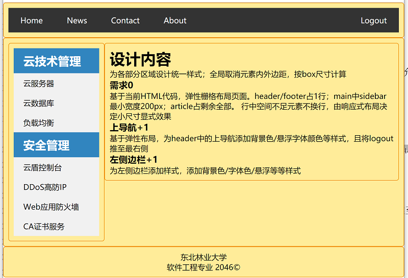

**# 实验三 CSS基本网页布局实验
### 实验原理
通过定义css样式，理解css属性以及页面真整体结构布局的方法及设计思想。
### 实验目的
理解并掌握多种css选择器的使用方法  
理解并掌握后代选择器的作用及使用设计方法  
理解并掌握伪类的作用、意义及使用方法  
理解并掌握基于div容器页面布局的方法  
理解并掌握页面整体结构布局的实现方法及设计思想  
理解并掌握上导航、边侧栏的实现方法及设计思想  

### 实验内容
基于web-experiments项目   
在src/main下，创建webapp目录   
在webapp目录下，创建layout.html文件，基于给定HTML代码实现页面布局设计，允许添加class等属性引入css样式  

### 需求+设计提示 
为各部分区域设计统一样式；全局取消元素内外边距，按box尺寸计算   

**需求0**  
基于当前HTML代码，按12栅格布局页面。  
Container根容器居中最大宽度960px  
Row弹性行容器  
header/footer各占1行12列   
main中sidebar占3列；article占9列。  

**上导航+1**  
header中声明上导航，添加背景色/悬浮字体颜色等样式，且将logout推至最右侧  

**页脚+1**  
元素居中

**左侧边栏+1**  
为左侧边栏添加样式，添加背景色/字体色/悬浮等等样式

运行显示结果  
**