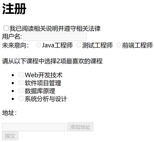

# 实验四 jQuery表单处理实验
### 实验原理
通过jQuery实现修改HTML标签属性，完成网页的动态显示效果，理解JavaScript语法、动态页面的实现原理、基本设计思想及实现方法。

### 实验目的
理解并掌握基于id、class、name等HTML属性选择器的实现方法  
理解并掌握控制disabled、checked、hidden等HTML标签元素属性值的方法  
理解并掌握控制if、for等基本语法的使用  
理解并掌握HTML基本事件方法  
理解并掌握jQuery中css选择器，jQuery选择的使用方法  
理解并掌握jQuery基本事件监听方法  
理解并掌握Callback回调方法的作用、意义  
理解并掌握定义回调的匿名方法的实现方法  
理解并掌握基本jQuery基本动画效果的实现方法  

### 实验内容
创建maven Web项目及模块，experiment-04，项目打包类型为war
### 需求+设计提示 
**需求+1**  
模拟二级菜单无法全部展开的，多二级菜单的侧边栏。
通过jquery实现点击一级标题展开其下的二级菜单，同时收缩其他已展开的二级菜单。即，同一时间只有一个二级菜单展开。   

先看解决方案解决思路，尝试自己解决，再查询提供的参考代码   
正确引用jquery文件，请求声明自定义js代码

**解决方案**   
通过jquery监听标题的点击事件，当任一标题被点击，获取其下的ul元素，对此ul实现滑动切换，即当其已经是展开状态，
则滑上；再通过选择器获取全部导航的ul，在其中过滤掉当前ul，滑上。   

滑上slideUp()；滑动切换slideToggle()；   
next()方法，获取元素对象平级的，下一个指定元素；   
not()方法，从选取的全部元素中排除指定元素   
2个ul的二级菜单，如何实现获取被点击标题下的那个ul元素？

**需求+1**  
必须同意协议，方可填写注册表单   
用户名必须大于等于6位，否则弹出警告框   
未来意向，支持取消选中的单选框   
喜欢的课程，能且仅能选择2项   
当用户名大于等于6字符，喜欢的课程小于等于2项时，不可提交表单    

**解决方案**   
协议，对多个元素实现同时的disabled/abled元素状态。  
实现思路：初始化时，基于jquery将表单内所有输入域禁用，协议复选框选中结果，
与表单内除提交按钮以外的全部元素禁用状态绑定。Form表单没有disabled属性。

用户名，监听值改变事件判断用户输入长度。

课程，判断数量，disabled/abled部分元素。实现思路：监听checkbox组的点击事件，
判断选中状态数量与设定数量关系，注意使用合适的选择器。

提交按钮，当符合2个条件时，按钮可用。实现思路：为2个条件声明判断标识，
在元素事件监听中改变标识值，监听指定元素值改变事件，判断标识。

动态添加地址，动态在列表中添加元素。实现思路：监听button click事件，
创建不显示的元素对象，追加至列表底端，添加滑动动画效果   

**需求+1**  
输入地址后，点击添加地址按钮，将输入信息动态添加至列表   

**需求+1**  
意向，再次点击radio时取消radio的选中状态。 

**实现思路**   
添加HTML隐藏输入框，用于存放单选框值，点击单选框时判断值是否与隐藏域相等；   
不相等，则为第一次点击，将单选框值赋给隐藏框，   
相等，则为第二次点击，置被点击单选框为未选中状态，重置隐藏域值   

无法基于radio checked状态判断，因为每次点击radio时该radio均为checked状态

