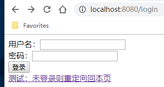

# Experiment-05, Servlet/Filter实验
###实验原理
通过Servlet完成Web应用的请求、响应、页面文件的转发以及重定向，通过Filter完成对请求的拦截与处理，声明周期回调方法的作用与意义。

### 实验目的
理解并掌握Servlet文件的创建与配置方法  
理解并掌握Servlet对get请求处理以及转发方法  
理解并掌握Servlet对post的处理以及重定向方法  
理解并掌握session scope的作用意义以及实现方法  
理解Servlet Filter的实现原理  
理解并掌握Servlet Filter的创建/拦截规则/配置的方法  
理解并掌握Servlet Filter过滤方法的实现

### 实验内容
创建maven Web项目及模块，experiment-05  
声明项目打包类型，声明java版本，添加Servlet依赖，添加打包插件  
创建webapp目录，创建WEB-INF安全目录，创建jsp目录，存储页面资源  

### 需求+设计提示
**需求+1**  
在/WEB_INF/jsp/下，创建login.html登录页面，声明登录form表单，向/login发出请求  
在/WEB_INF/jsp/下，创建welcome.html页面，声明欢迎文本  

在java目录下，编写java代码  
在com.controller下，创建LoginServlet类，处理/login地址请求，重写doGet()方法，转发请求至login.html  
在com.controller下，创建WelcomeServlet类，处理/welcome地址请求，重写doGet()，转发至welcome.html  
在login.html添加，向/welcome地址请求的超链接  
基于IDEA&Tomat/Encoding&WAR&JSP视频，在调试模式下，部署运行项目至tomcat服务器  
向login发起请求，正确运行后，浏览器将显式登录页面  
ctrl+F9在debug运行模式下重新编译/部署项目  

**需求+1**  
在com.entity下，创建User实体类，声明用户姓名/账号/密码等私有属性  
重写LoginServlet的doPost()方法，获取页面传入的登录账号/密码参数，
实现当账号/密码为指定字符串时，创建user对象，并将对象添加至session中  
且，登录成功，重定向到/welcome，即welcome页面；登录失败，重定向到/login，即登录页面  

此时，仍可直接向/welcome地址发送请求  

** 需求+**  
在com.filter下，创建LoginFilter过滤器，声明排除路径，重写doFilter()方法，判断请求路径是否为排除路径，判断用户是否已登录  
从而实现，当用户已登录，可以直接发送/welcome请求；未登录，重定向到/login登录  
关闭/重启服务器(为了清空session)，尝试在登录/未登录状态下，向/welcome请求  
