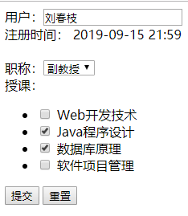

# Experiment-06, EL/JSTL实验
###实验原理
通过结合HTML标签、JSTL标签、EL表达式，以及逻辑判断，
遍历循环等完成对各种类型对象封装属性的显示，并能通过定义显示模式显示不同效果。

### 实验目的
理解并掌握EL表达式的使用方法及基本语法  
理解并掌握JSTL循环、判断等基本标签的使用  
理解并掌握JSTL标签对HTML标签的控制方法  
理解并掌握JSTL标签、EL表达式、HTML标签的整合方法  
理解在JSP页面使用EL表达式以及JSTL标签的作用与意义  

### 实验内容
创建maven Web项目及模块，experiment-07
声明项目打包类型，声明java版本，添加Servlet依赖，添加JSTL依赖  
创建webapp目录，创建WEB-INF安全目录，创建jsp目录  
entity下的实体类，以及util下的模拟数据类DatabaseUtils可直接复制使用，无需编写。  

**需求+1**  
以表格形式显示所有注册教师姓名及注册时间  
且教师姓名为可点击的超链接，点击后跳转至教师详细信息页面  
在详细页面以表单形式，基于教师注册过的信息，加载初始化页面  
提交表单后，在控制台打印显示修改后的数据  

**解决方案**  
项目结构规范：所有控制层组件servlet，置于com.controller包下；所有视图文档，置于/WEB-INF/jsp/目录下  
创建加载显示全部教师的listteachers.jsp页面，
在文档顶部引入JSTL标签库，通过EL表达式与JSTL标签，动态生成表格，动态生成超链接的地址及参数数据  
创建处理对应请求的ListTeachersServlet，调用DatabaseUtils中的相应方法，获取全部教师对象并转发至视图页面  
创建updateteacher.jsp页面以及表单，在表单标签中加载教师详细信息，
在页面引入核心及格式化标签库，按以下样式加载基本数据，基于逻辑判断，
按教师原注册的职称及课程数据，渲染初始化页面  
创建处理对应请求的UpdateTeacherServlet，获取教师ID参数，调用DatabaseUtils中的相应方法，
将：指定教师/全部职称/全部课程对象，转发至页面  
由UpdateTeacherServlet，同时处理提交修改post请求，获取请求参数并打印显示  

向声明的地址发送请求  
http://localhost:8080/listteachers  
  
http://localhost:8080/updateteacher?tid=2  
  