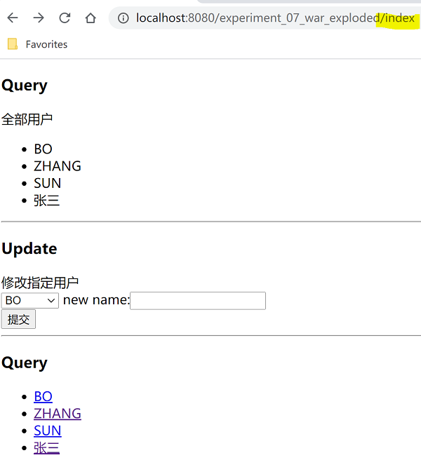

# Experiment-07, JDBC实验
###实验原理
通过配置DataSource连接数据库，通过JDBC Connection、PreparedStatement、ResultSet接口完成数据库操作。

### 实验目的
理解在Tomcat服务器配置DataSource数据源  
理解并掌握创建容器启动监听器的方法  
理解并掌握基于JNDI树自动注入DataSource数据源对象的方法  
理解并掌握Connection接口的基本使用方法  
理解并掌握通过PreparedStatement接口执行SQL语句的方法  
理解并掌握PreparedStatement接口赋值传参的方法  
理解并掌握通过ResultSet接口获取查询结果的方法  
理解并掌握基于try with resources的资源自动关闭的方法  

### 实验内容
创建maven项目experiment-07  
声明项目打包类型，java版本，Servlet/JSTL/MySQL驱动/Annotation依赖，添加打包插件    
远程IP：114.116.213.241。视频Remote MySQL Connections
 - 基于idea database视图，个人学号/密码登录远程MySQL数据库  
 - 在已经默认创建的以个人学号命名的数据库下，创建数据表user，添加id/name/inserttime数据段，并声明合适类型
 - inserttime段为时间戳类型，默认值为随段信息更新而自动更新  
 - 添加若干测试数据记录  

在webapp下，创建META-INF目录，直接复制context.xml资源配置文件，修改配置数据  
在com.entity下创建User实体类，声明id/name/insertTime等合适数据类型属性，对应数据库字段  
在com.util下，创建容器启动监听器DataSourceUtils，丛JNDI树获取DataSource对象，暴露连接对象获取方法  
创建全局过滤器，修改请求/响应编码，否则提交的数据会按ISO编码并保存在数据库    

**需求+1**  
在com.controller下，创建IndexServlet，重写doGet()方法。
基于JDBC查询全部用户信息，封装每一条记录为对象，创建集合封装对象，推送到index.jsp页面  
在/WEB-INF/jsp/下，创建index.jsp，基于JSTL标签，加载全部用户为列表  
页面声明动态获取部署路径，作为页面基本路径    

**需求+1**  
在index.jsp添加form表单，添加基于用户集合动态创建的下拉框；添加输入框  
在com.controller下，创建UpdateUserServlet类，接收用户ID与新用户名，通过JDBC修改指定ID的用户名  
并重定向回index，在Servlet中可通过req.getContextPath()方法，获取项目部署路径，拼接重定向地址(部署路径可能无法确定)  

**需求+1**  
在index.jsp用户名列表，添加跳转超链接
在com.controller下，创建GetUserServlet类，基于接收的用户ID，查询用户新建，封装。转发至query.jsp视图
创建query.jsp，显式用户详细信息  

运行部署项目至Tomcat，向index发起请求，查看结果，并测试功能  

