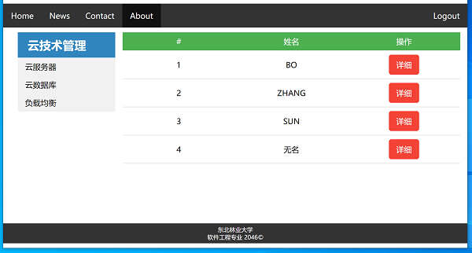

# Experiment-08, MVC实验
###实验原理
整合课程学习内容，基于MVC设计模式完成项目的设计与开发。

### 实验目的
理解MVC设计模式  
理解并掌握项目工程基于JavaBeans+JSP+Servlet的MVC设计模式的实现方法  
理解并掌握基于MVC设计模式，controller service jsp视图的组织结构  
理解并掌握Web工程：静态资源，静态/动态视图资源，数据库资源，第三方库等的整体结构布局设计  
理解并掌握静态资源的引用方法  

### 实验内容
创建maven项目experiment-08  
本实例内容，着重强调基于MVC设计模式Web工程项目的整体结构，所有代码/文件可直接使用  
直接基于experiment-07项目，完成  
  
**需求+1**  
在/WEB-INF/jsp/下
创建header.jsp代码片段，定义上导航内容及样式  
创建footer.jsp代码片段，定义页脚内容及样式  
创建sidebar.jsp代码片段，定义左导航代码片段  

在com.controller下，创建IndexServlet类，获取全部用户信息，并推送到index.jsp页面  
在/WEB-INF/jsp/下，创建index.jsp，基于jsp指令，引入header/footer/sidebar文件，定义整体样式及表格等样式，动态生成表格数据

**需求+1**  
在index.jsp用户名列表，添加跳转超链接
在com.controller下，创建GetUserServlet类，基于接收的用户ID，查询用户新建，封装。转发至query.jsp视图
创建query.jsp，显式用户详细信息  

运行部署项目至Tomcat，向index发起请求  

