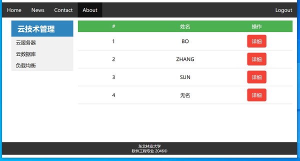

# Experiment-08, MVC实验
### 实验原理
整合课程学习内容，基于MVC设计模式完成项目的设计与开发。

### 实验目的
理解MVC设计模式。  
理解并掌握Web项目基于JavaBeans+HTMl+Servlet的MVC设计模式的实现方法。  
理解并掌握基于MVC设计模式，controller/service/HTML视图的组织结构。  
理解并掌握Web工程：静态资源，静态/动态视图资源，数据库资源，第三方库等的整体结构布局设计。  
理解并掌握静态资源的引用方法。  

### 实验内容
基于web-experiments项目。   
本实例内容，着重强调基于MVC设计模式Web工程项目的整体结构，所有代码/文件可直接使用。  
直接基于 `视图动态渲染实验` `JDBC实验` 完成。

基本依赖；数据源配置；DataSourceUtils/JacksonUtils工具类，等。

**需求+1**  
com.service下，创建UserService接口，声明获取全部用户等业务方法。  
com.service.impl下，创建UserServiceImpl实现类，调用JDBC实现业务方法。  
com.service下，创建ServiceFactory工厂类，封装构建UserService组件。  

com.controller下，创建ListUsersServlet类，调用UserService组件获取全部用户信息，序列化返回。

**需求+1**  
/webapp/layout/下创建:  
header.html代码片段，定义上导航内容及样式。  
footer.html代码片段，定义页脚内容及样式。  
sidebar.html代码片段，定义左导航代码片段。

创建index.html视图。布局网页整体结构，固定容器最大宽度，最小一屏高度，弹性占用等。  
基于jquery引入视图组件片段填充。  
请求后端数据，渲染填充表格。  

