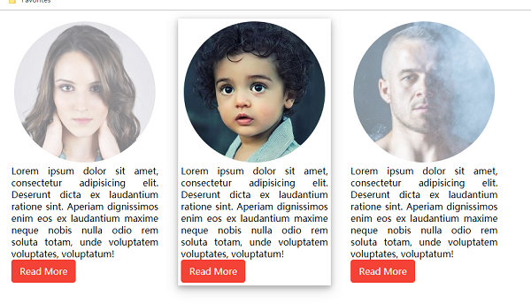

# Homework-04
### Material Icon响应式布局
### 原理与思路
**布局**   
声明弹性容器      
声明左导航，右侧主区域  
导航项中，声明可点击的超链接，超链接内容为分别声明的图标与span文本容器  
右主区域  

**样式**   
引入Google Material Icon  
全局box计算模式   
弹性容器  
左导航容器，声明最小宽度180px  
项的超链接撑开，确定颜色等基本属性  
超链接内的图标/文本，通过vertical-align居中对齐  
悬浮时改变背景色  
当小于600px时，更改导航区最小宽度，将超链接中的文本取消显式，即仅显示图标  

# Homework-03
### Google Material Icon fixed布局
实现左侧固定的侧边栏导航，侧边栏中基于网络提供的Icon图标实现     
Google Material Icon，是Google设计提供的一套免费开源的图标库   
Google官方最新为v4版，用以下v3即可  
学习使用方法及国内CDN：http://micon.dxbtech.cn/   
正确引入css后，声明展示对应的图标   

### 原理与思路
布局   
声明全局容器    
声明导航容器   
导航容器中，声明放置图标的item容器   
item容器中声明超链接，超链接内容为icon   
声明复制若干item容器   
声明主容器   
主容器中声明段落   

样式   
全局box计算模式   
全局弹性容器  
左导航容器，显式声明宽度，高度为浏览器窗口高度，固定。即，当内容长度超过一屏可滚动时，左导航不动   
右侧主区域容器，占用除左导航外的最大
- 由于左侧导航按固定布局，因此，弹性布局不计算其尺寸。
即，此时弹性容器内，仅有一个主容器。
因此，主区域容器布局时，用margin据左为左导航宽度，从而避免导航压住内容区域   

item容器，中内容居中，即超链接居中   
超链接导航，内边距撑开，可点击范围为全部item等   
Google图标，为Google图标创建一个自定义样式类，声明图标的颜色/尺寸样式   
Google图标库基于文本声明，因此图标的颜色/尺寸等是基于文本的属性   
当悬浮在item，item向上移动5px，添加渐进效果。即，当悬浮时，有图标向上跳一下的效果   
# Homework-02
### Card布局
掌握以上给定的HTML布局方法，最后一次提供HTML布局，下次作业的HTML布局代码也自己写了   
基于Card设计模式，实现人物描述布局样式      
网站测试图库，网站提供多种尺寸风格的图片，可用于测试：  
https://pravatar.cc/ (可能无法访问)   
https://picsum.photos/  

### 原理与思路
布局   
声明全局容器   
声明card容器   
card容器中声明header容器，header容器中声明引用一张网络图片   
card容器中声明content容器，content容器中声明描述段落，与超链接   
在全局容器中，创建3个card，指定不同图片   

样式   
全局box计算模式   
声明全局容器为弹性容器，将其中的3个card弹性横向布局   
card容器：合适宽度，合适的内外边距，内部元素居中   
header中的图片：显示为圆形半透明，尺寸按容器缩放   
描述内容：两端对齐   
超链接：背景淡红，的按钮式超链接    
当悬浮在card：card添加阴影   
当悬浮在card：图片不再透明，且添加渐变效果  
当悬浮在按钮式超链接：背景色纯红   

# Homework-01
### form表单布局
掌握以上给定的HTML布局方法   
基于以上已实现的form布局，通过添加CSS代码实现需要的样式   
参考：https://v4.bootcss.com/docs/components/forms/   

#### 原理与思路
所有文本，密码的input元素，全局横向占用最大，圆角，内边距；   
声明form-group类，放置说明与输入域的行容器，横向弹性布局，元素居中对齐；   
声明form-label类，放置说明，文本右对齐，占20%，注意弹性百分比的占用属性；   
声明form-input类，放置输入域，互交的输入域可能是多个，因此是容器，占80%；   
元素间，通过内边距推开   