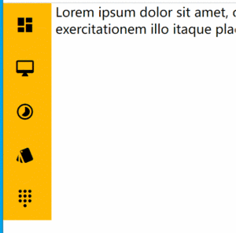
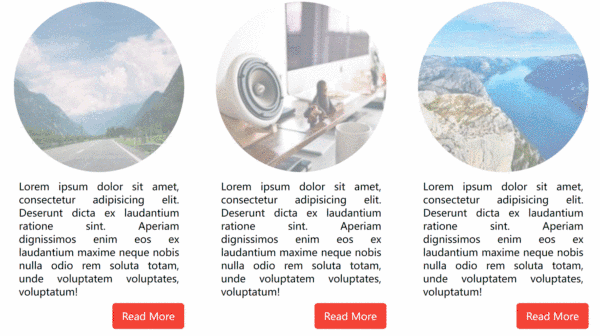

# Homework-06, Modal模态框
Modal模态框是一种更灵活、更强大的自定义对话框  
实现效果：当模态框被激活，覆盖在网页内容上，并在弹出的窗口中显式详细互交信息  
参考：https://getbootstrap.net/docs/components/modal/  

### 原理与思路
**布局与样式**  
modal容器，全屏，默认隐藏，显式时绝对定位覆盖在显式窗口。包含modal-dialog容器  
模态框容器背景色透明，而非元素透明，否则容器内的元素也会透明。rgba()  
modal-dialog容器，为模态框信息容器，显式声明宽度，居中，相对modal定位，从而可以添加渐入渐出效果。可包含header/content/footer部分容器  
modal-header容器，模态框内容中的标题区域，标题字体，边距/边框等  
modal-content/modal-footer容器，主内容/页脚区域，字体/按钮组/边距等  

**jquery**  
抽象设计模态框组件与激活组件。绑定模态框组件ID至激活组件的data-target自定义属性中。
即，监听任何具有data-target属性组件的点击事件，获取其绑定的模态框id值，从而基于id获取模态框对象，渐出该模态框。  
希望实现，当点击模态框内，对话框外，即空白背景区域时，关闭模态框。
但空白区域不是独立的元素，是模态框元素的一部分。即，无法通过选择器选取该区域  
如果给模态框容器整体添加点击监听，当点击模态框内的互交对话框时，一样会关闭模态框，从而无法实现与对话框的互交  

事件的向上冒泡传递机制  
当子元素事件被激活，一样会影响到父元素监听的事件。
即，当激活子元素点击事件，如果父元素也注册了点击事件，则也会激活父元素的点击事件。即，事件的向上冒泡传播  
因此，可通过在子元素中阻止事件的冒泡，实现在对话框内操作时，不会影响到模态框容器  
实现，监听模态框内对话框的监听事件，回调中直接返回false，即可阻止激活父元素模态框的点击事件  
任何具有自定义data-dismiss属性的元素被点击时，向上查询所有父元素节点，关闭其所在模态框  
为modal-footer中的关闭按钮，赋自定义关闭属性  

可通过animate()方法，添加对话框的动态定位，从默认的顶端，渐变定位到距上30px，即对话框从上向下渐入；
关闭模态框时，再将对话框渐变定位到顶端，即，从下向上渐出  

# Homework-05, Float Button布局
实现效果：当悬浮在浮动按钮，动态改变按钮图标，过渡旋转180度，渐入二级图标列表     

### 原理与思路
难点在于：  
通过jquery动态改变元素文本内容，从而改变浮动按钮图标  
通过CSS实现转动较简单，但不利于动态/抽象改变元素文本内容  
因此需要结合jquery+css共同实现  

**布局/样式**  
fab浮动容器，绝对定位到右上角，内容居中；包含：fab-btn按钮容器，fab-menu容器   
fab-btn容器，包含浮动按钮图标，颜色/尺寸大小等等；按钮图标最好选用实心图标，空心最好加背景，否则浮动按钮可能不明显  
fab-menu容器，隐藏。包含列表，每个列表项中超链接，内容为图标    
可声明特定的二级图标样式，例如删除为红色  
悬浮在fab容器时，按钮图标过渡旋转180度  

jquery
容器悬浮监听，进入，修改按钮图标，fab-menu渐入；移出，改回按钮图标，fab-menu渐出   

# Homework-04, Navigation Drawer响应式布局
### 原理与思路
**布局**   
声明弹性容器      
声明左导航，右侧主区域  
导航项中，声明可点击的超链接，超链接内容为分别声明的图标与span文本容器  
右主区域  

**样式**   
引入Google Material Icon  
全局box计算模式   
弹性容器  
左导航容器，声明最小宽度180px  
项的超链接撑开，确定颜色等基本属性  
超链接内的图标/文本，通过vertical-align居中对齐  
悬浮时改变背景色  
当小于600px时，更改导航区最小宽度，将超链接中的文本取消显式，即仅显示图标  

**需求+1**  

# Homework-03, Badges布局 
Google Material Icon，是Google设计提供的一套免费开源的图标库   
Google官方最新为v4版，用以下v3即可  
学习使用方法及国内CDN：http://micon.dxbtech.cn/   
正确引入css后，声明展示对应的图标
### 原理与思路
**布局**  
badge整体容器，包含：badge-content容器，badge-wrapper容器  
badge-content容器，内容为图标  
badge-wrapper容器，内容为数字

**样式**  
引入Google Material Icon  
badge-content容器中图标，声明合适颜色尺寸等  
badge-wrapper容器，定位在badge整体容器右上角；背景色/字体色/字体尺寸  
badge-wrapper容器如何变成圆形？数字叠加在图标上，有一圈白色空间？

# Homework-02, Card弹性列表布局
掌握以上给定的HTML布局方法，最后一次提供HTML布局，下次作业的HTML布局代码也自己写了   
基于Card设计模式，实现图片描述布局样式      
网站测试图库，网站提供多种尺寸风格的图片，可用于测试：  
https://picsum.photos/  

### 原理与思路
布局   
声明全局容器   
声明card容器   
card容器中声明header容器，header容器中声明引用一张网络图片   
card容器中声明content容器，content容器中声明描述段落，与超链接   
在全局容器中，创建3个card，指定不同图片   

样式   
全局box计算模式   
声明全局容器为弹性容器，将其中的3个card弹性横向布局   
card容器：合适宽度，合适的内外边距，内部元素居中   
header中的图片：显示为圆形半透明，尺寸按容器缩放   
描述内容：两端对齐   
超链接：背景淡红，的按钮式超链接    
当悬浮在card：card添加阴影   
当悬浮在card：图片不再透明，且添加渐变效果  
当悬浮在按钮式超链接：背景色纯红  

**需求+1**  

# Homework-01, form表单布局
掌握以上给定的HTML布局方法   
基于以上已实现的form布局，通过添加CSS代码实现需要的样式   
参考：https://v4.bootcss.com/docs/components/forms/   

#### 原理与思路
所有文本，密码的input元素，全局横向占用最大，圆角，内边距；   
声明form-group类，放置说明与输入域的行容器，横向弹性布局，元素居中对齐；   
声明form-label类，放置说明，文本右对齐，占20%，注意弹性百分比的占用属性；   
声明form-input类，放置输入域，互交的输入域可能是多个，因此是容器，占80%；   
元素间，通过内边距推开   

**需求+1**  

